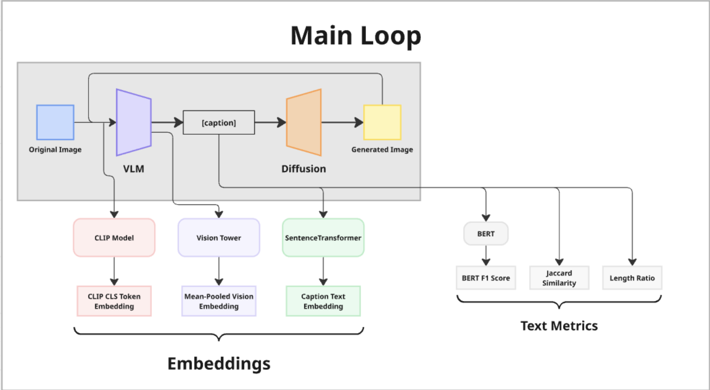

VLM Iterative Loss
==================

Iterative caption→image→caption experiments using LLaVA + Stable Diffusion, tracked with CLIP and probed with K-Means to study convergence, drift, and attractors in the feedback loop of data compression.

Visual overview
---------------
| Caption→Image Loop | Loop With Example Frames |
| --- | --- |
|  |  |

| Embedding Clusters | Post-Run Analysis |
| --- | --- |
|  |  |

What’s inside
-------------
- Multi-iteration pipeline that captions COCO images with LLaVA, regenerates images via StableDiffusion, and measures similarity at every hop with LLaVA vision embedding + CLIP + sentence transformers.
- Baselines for StableDiffusion-only, random captions, and fixed captions to compare against the feedback loop dynamics.
- K-Means + PCA analysis tooling to track cluster stability, centroid drift, and convergence across iterations.
- Experiment artifacts saved under `experiments/` with images, plots, CLIP checkpoints, CSVs, and metadata for reproducibility.

Quickstart
----------
1) Install Python deps (GPU strongly recommended):
   - `pip install torch torchvision torchaudio --index-url https://download.pytorch.org/whl/cu118`
   - `pip install transformers diffusers accelerate sentence-transformers datasets bert-score scikit-learn matplotlib pillow`
   - Login to Hugging Face if the models require auth (`huggingface-cli login`).
2) Run the iterative loop:
   - `python scripts/main_pipeline/test_pipeline_lambda.py`
   - Tune constants like `NUM_ITERATIONS`, `NUM_IMAGES`, and `INCLUDE_BASELINES` at the top of the script.
   - Outputs land in `experiments/<timestamp>_iter<iters>_img<imgs>/` with images, plots, `metadata.json`, and an iteration CSV.
3) Run baselines on a completed run:
   - `python scripts/main_pipeline/run_baselines.py --run-dir <experiments/...>`
   - Produces `baseline_clip_embeddings.npz` plus a small metadata JSON inside the run directory.
4) Analyze embeddings with K-Means:
   - `python scripts/main_pipeline/kmeans_analysis.py <experiments/...> --k-values 5,10,15 --pca-scope global`
   - Writes results to `analysis/kmeans/<timestamp>/kmeans_analysis.json` and saves plots/centroid label dumps for downstream probes.

Repo guide
----------
- `scripts/main_pipeline/test_pipeline_lambda.py` — main caption↔image loop and metric logging.
- `scripts/main_pipeline/run_baselines.py` — SD-only, random, and fixed-caption rollouts for comparison.
- `scripts/main_pipeline/kmeans_analysis.py` — PCA + K-Means analysis, plots, and contact sheets.
- `experiments/` — recorded runs, checkpoints, and analysis outputs.
